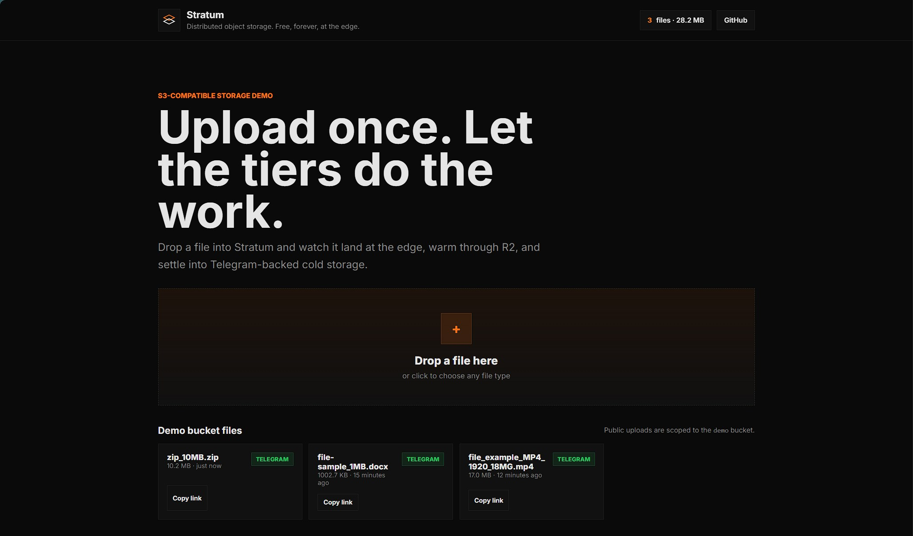
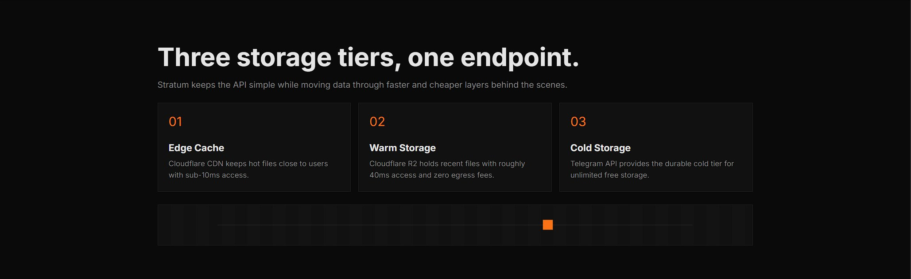

# Stratum

> Distributed object storage at the edge. S3-compatible API built entirely on Cloudflare's free tier.

  





## What it is

Stratum is an S3-compatible object storage system that runs 100% on Cloudflare's free tier. It solves low-cost file storage by combining a three-tier architecture: Cloudflare's edge cache for hot reads, R2 for warm files, and Telegram Bot API as the cold storage backend.

## Architecture

```text
Client -> Cloudflare Workers API gateway -> D1 metadata -> R2 warm cache -> Telegram Bot API cold storage
```

| Layer | Technology | Purpose |
|---|---|---|
| API Gateway | Cloudflare Workers (TypeScript) | S3-compatible endpoints, auth, routing |
| Metadata | Cloudflare D1 (SQLite) | Buckets, objects, credentials |
| Warm Cache | Cloudflare R2 | Files <=20MB, ~40ms access |
| Cold Storage | Telegram Bot API | Unlimited free storage, ~800ms access |
| CDN | Cloudflare Cache | Sub-10ms for hot files |
| Dashboard | Served from Worker | Public demo UI |

## Key Engineering Highlights

- S3 API compatibility across PUT, GET, HEAD, DELETE, list buckets, list objects, multipart upload, object copy, tags, lifecycle config, and presigned URLs.
- Three-tier caching across Cloudflare CDN, R2, and Telegram with measured smoke-test read/write correctness; latency benchmark pass pending.
- SHA-256 payload verification and Content-MD5 validation on uploads that provide integrity headers.
- D1-backed metadata with per-bucket object scoping, credentials, share tokens, lifecycle rules, and multipart state.
- Deployed at the edge across Cloudflare's global network, spanning 330+ cities in 120+ countries.
- Zero infrastructure cost: the core service runs on Cloudflare Workers, D1, R2, and Telegram's Bot API.

## Live Demo

https://stratum.opener.workers.dev

Upload a file and watch it move through the storage tiers in real time.

## Tech Stack

     

## Local Development

```bash
npm install
wrangler dev
```

See the [Cloudflare Workers docs](https://developers.cloudflare.com/workers/) for more context.

## Deploy

```bash
wrangler deploy
```

Deploys the Worker.
